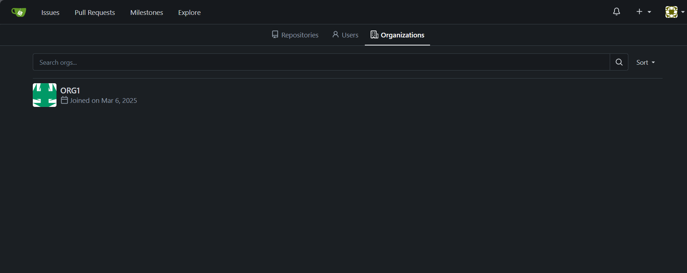
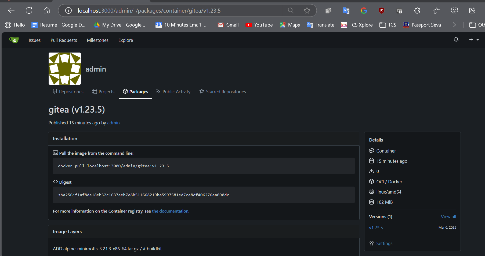

# How I have used Docker Compose to run the gitea application

```sh
docker compose build
```

```sh
docker compose up -d
```

## Challenges faced:

1. some network related challenges I have faced initially as forgot to mention same network under gitea app service. so it was unable to connect to Database
1. First time app container will fail as db is not there and needs to be created manually by connecting to the db_service through below command
   - `docker exec -it gitea_pgdbC1 sh`
   - in DB folder those Db creation commands are there.
1. admin user was not created by default and installation page was not coming as I have taken the app.ini template from initial installation and created the image . So after first login with a new user it became the super admin.
1. bash was missing so raises issue:#1 and fixed it by rebuilding the image and redeployed.
1. post login tried push same image as package in gitea package registry
   
   
